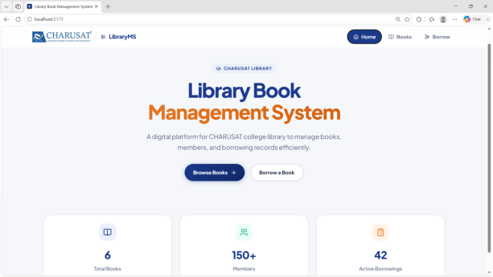
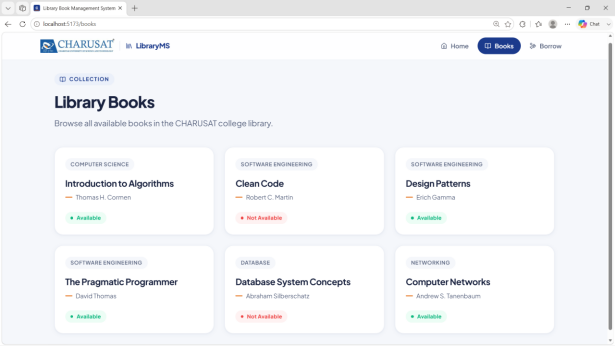
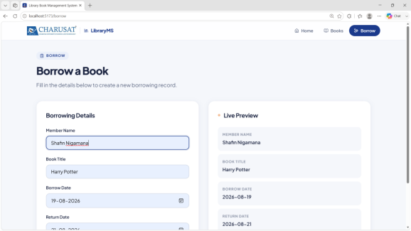

# CHARUSAT — Library Book Management System

**Course:** ITUE301 — Advanced Web Development Frameworks  
**Examination:** Open-Book Practical Examination (AY 2026–27)  
**Set:** SET B — Library Book Management System  
**Tech Stack:** React (Vite) + Express.js + MongoDB (Mongoose) + Vanilla CSS (CHARUSAT Brand System)

---

## 📸 Application Screenshots

### 1. Home Page (Overview & Quick Statistics)


### 2. Books Page (Task 1 & Task 4 — Real-time API Consumption with Cards)


### 3. Borrow Page (Task 2 — Controlled Form with Live State Preview)


---

## 🛠️ Tech Stack & Architecture

- **Frontend:** React 18, Vite 5, React Router v6, Lucide React icons
- **Backend:** Node.js, Express.js, CORS, Dotenv
- **Database:** MongoDB, Mongoose ODM
- **Design System:** Custom Vanilla CSS utilizing CHARUSAT brand colors (`#1B3A8C` Royal Blue & `#E87722` Accent Orange)

---

## 📋 Task Coverage Summary

| Task | Topic | Implementation Details |
|---|---|---|
| **Task 1** | React Component Architecture | `HomePage`, `BooksPage`, `BorrowPage`, reusable `BookCard` with props (`title`, `author`, `category`, `available`) and dynamic status badge |
| **Task 2** | Routing & State Management | Client-side routing with `react-router-dom` (`/`, `/books`, `/borrow`), non-reloading `<Link>` navbar, controlled form inputs (`useState`), real-time Live Preview |
| **Task 3** | Express REST API & Middleware | Modular REST endpoints (`/api/v1/books`, `/api/v1/borrowings`), custom request logger middleware `[METHOD] [PATH] [TIMESTAMP]`, global error handling middleware |
| **Task 4** | React API Consumption | `useEffect` asynchronous data fetching with `data`, `loading`, and `error` state handling + conditional rendering |
| **Task 5** | MongoDB & Mongoose Integration | Mongoose models with validation rules (`Book`, `Member`, `Borrowing`), Mongoose object references (`ref`), custom error responses for validation failures |

---

## 🚀 Setup & Execution Guide

### 1. Prerequisites
- **Node.js** (v18+ recommended)
- **MongoDB** running locally on `mongodb://localhost:27017`

### 2. Backend Setup
```bash
cd backend
npm install
node server.js
```
*Backend server will start on `http://localhost:5000` and automatically connect to `mongodb://localhost:27017/library_db`.*

### 3. Frontend Setup
```bash
cd frontend
npm install
npm run dev
```
*Frontend dev server will start on `http://localhost:5173`.*

---

## ⚙️ Environment Variables

Create a `.env` file inside the `backend` directory (or use `.env.example` as a template):

```env
PORT=5000
MONGO_URI=mongodb://localhost:27017/library_db
```

---

## 🔌 API Reference

### In-Memory Endpoints (Task 3 & 4)
| Method | Endpoint | Description |
|---|---|---|
| `GET` | `/api/v1/books` | Fetches list of all in-memory library books |
| `GET` | `/api/v1/borrowings` | Fetches all in-memory borrowing records |
| `POST` | `/api/v1/borrowings` | Creates a new in-memory borrowing record |

### MongoDB Endpoints (Task 5)
| Method | Endpoint | Description |
|---|---|---|
| `GET` | `/api/v1/mongo/books` | Fetches all books stored in MongoDB |
| `POST` | `/api/v1/mongo/books` | Creates a new book in MongoDB (validates title, author, category, unique ISBN) |
| `POST` | `/api/v1/mongo/members` | Creates a new member in MongoDB (validates unique email, department) |
| `GET` | `/api/v1/mongo/borrowings` | Fetches borrowing records with populated member and book details |
| `POST` | `/api/v1/mongo/borrowings` | Creates a borrowing record linking `memberId` and `bookId` with status validation |
